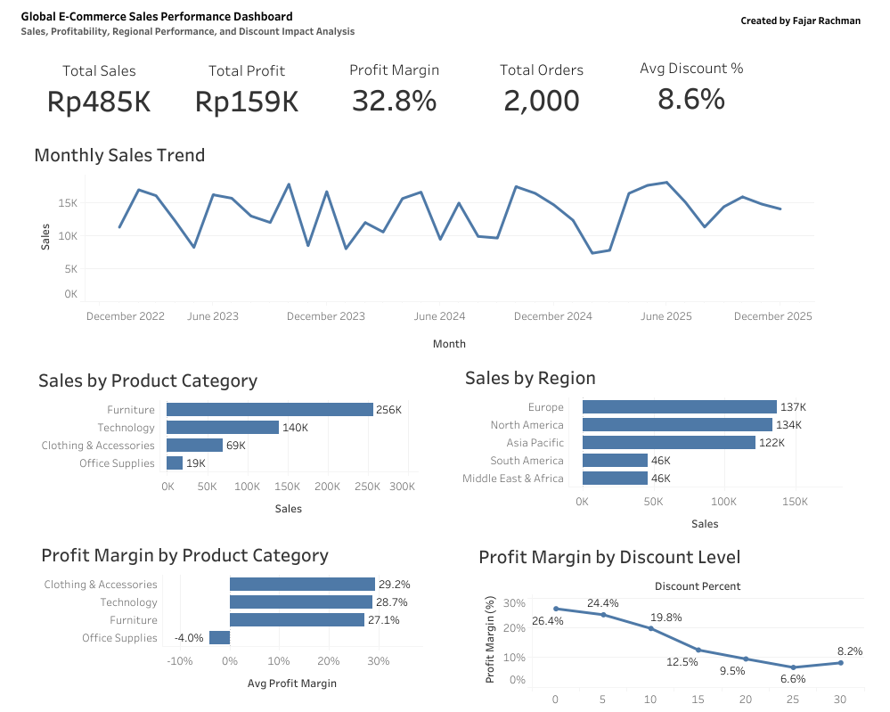

# Global E-Commerce Sales Performance Dashboard

## Project Overview

Project ini menganalisis performa penjualan global pada bisnis e-commerce berdasarkan kategori produk, region, customer segment, dan tingkat diskon. Tujuan utama dari project ini adalah untuk mengidentifikasi faktor-faktor utama yang memengaruhi sales, profit, dan profit margin, lalu menyajikannya dalam bentuk dashboard interaktif menggunakan Tableau.

Analisis ini tidak hanya berfokus pada total revenue, tetapi juga melihat efisiensi profitabilitas melalui profit margin. Dengan begitu, project ini dapat membantu memahami kategori, region, dan strategi diskon mana yang memberikan performa terbaik, serta area mana yang perlu dioptimalkan.

## Dashboard

Dashboard interaktif dapat dilihat melalui link berikut:

[Global E-Commerce Sales Performance Dashboard](https://public.tableau.com/app/profile/fajar.rachman2467/viz/GlobalE-CommerceSalesPerformanceDashboard/Dashboard2?publish=yes)

## Business Questions

Project ini dibuat untuk menjawab beberapa pertanyaan bisnis berikut:

1. Bagaimana tren penjualan bulanan dari tahun 2023 hingga 2025?
2. Kategori produk mana yang memberikan kontribusi sales terbesar?
3. Region mana yang menghasilkan sales tertinggi?
4. Kategori produk mana yang memiliki profit margin terbaik dan terlemah?
5. Bagaimana pengaruh tingkat diskon terhadap profit margin?
6. Rekomendasi bisnis apa yang dapat diberikan berdasarkan pola sales dan profitability?

## Dataset

Dataset yang digunakan berisi data transaksi e-commerce global dari tahun 2023 hingga 2025.

Beberapa kolom utama dalam dataset:

- `Order_ID`
- `Order_Date`
- `Customer_Name`
- `Customer_Segment`
- `Country`
- `Region`
- `Product_Category`
- `Product_Name`
- `Quantity`
- `Unit_Price`
- `Discount_Percent`
- `Total_Sales`
- `Shipping_Cost`
- `Profit`
- `Payment_Method`

Beberapa kolom tambahan juga dibuat untuk mendukung proses analisis:

- `Profit_Margin`
- `Year`
- `Month`
- `Month_Name`

## Tools yang Digunakan

- Python
- Pandas
- Matplotlib
- Jupyter Notebook / VS Code
- Tableau Public
- GitHub

## Project Workflow

### 1. Data Understanding

Tahap pertama dilakukan untuk memahami struktur dataset, tipe data, missing values, duplicate values, dan distribusi awal dari data numerik.

Beberapa pengecekan yang dilakukan:

- Melihat struktur dataset
- Mengecek tipe data
- Mengecek missing values
- Mengecek duplikasi `Order_ID`
- Melihat statistik deskriptif

### 2. Data Cleaning

Pada tahap ini, data diproses agar siap digunakan untuk exploratory data analysis dan dashboard.

Proses cleaning yang dilakukan:

- Mengubah `Order_Date` menjadi format datetime
- Membuat kolom turunan seperti `Year`, `Month`, dan `Month_Name`
- Membuat kolom `Profit_Margin`
- Mengidentifikasi transaksi dengan profit negatif
- Menyimpan dataset hasil cleaning sebagai file baru

### 3. Exploratory Data Analysis

EDA dilakukan untuk menemukan pola dan insight bisnis dari beberapa sudut pandang.

Analisis yang dilakukan meliputi:

- Monthly sales trend
- Monthly profit trend
- Sales dan profit berdasarkan product category
- Profit margin berdasarkan product category
- Sales dan profit berdasarkan region
- Hubungan shipping cost dengan regional profitability
- Pengaruh discount level terhadap profit margin
- Performa berdasarkan customer segment

### 4. Dashboard Development

Dashboard dibuat menggunakan Tableau Public dengan pendekatan executive dashboard agar mudah dipahami oleh stakeholder non-teknis.

Komponen utama dashboard:

- KPI cards
- Monthly sales trend
- Sales by product category
- Sales by region
- Profit margin by product category
- Profit margin by discount level

## Key Insights

### 1. Sales bulanan menunjukkan pola yang fluktuatif

Tren penjualan bulanan dari tahun 2023 hingga 2025 menunjukkan fluktuasi yang cukup signifikan. Tidak terlihat tren pertumbuhan jangka panjang yang konsisten, sehingga performa sales kemungkinan dipengaruhi oleh faktor musiman atau periode campaign tertentu.

### 2. Furniture menjadi kategori dengan kontribusi sales terbesar

Kategori Furniture memberikan kontribusi sales tertinggi dibandingkan kategori lainnya. Hal ini menunjukkan bahwa Furniture merupakan salah satu revenue driver utama dalam dataset ini.

### 3. Europe dan North America menjadi region terkuat

Europe dan North America menghasilkan sales tertinggi dibandingkan region lainnya. Kedua region ini dapat dianggap sebagai market utama berdasarkan kontribusi revenue.

### 4. Clothing & Accessories memiliki profit margin terbaik

Meskipun Furniture memiliki total sales tertinggi, kategori Clothing & Accessories mencatat profit margin rata-rata tertinggi. Hal ini menunjukkan bahwa kategori tersebut lebih efisien dalam menghasilkan profit relatif terhadap nilai penjualannya.

### 5. Office Supplies memiliki profitabilitas paling lemah

Kategori Office Supplies memiliki profit margin paling rendah, bahkan menunjukkan margin negatif pada analisis profit margin per transaksi. Hal ini mengindikasikan adanya potensi masalah pada strategi pricing, shipping cost, atau discount strategy di kategori tersebut.

### 6. Discount yang terlalu tinggi menekan profit margin

Profit margin cenderung menurun ketika discount level meningkat. Penurunan margin mulai terlihat signifikan setelah discount melewati 10% hingga 15%. Hal ini menunjukkan bahwa pemberian diskon besar perlu dilakukan secara lebih selektif.

## Business Recommendations

### 1. Prioritaskan kategori dengan performa kuat

Furniture perlu tetap menjadi fokus utama karena memiliki kontribusi sales terbesar. Namun, kategori Clothing & Accessories dan Technology juga perlu mendapat perhatian karena memiliki profit margin yang sehat dan efisien.

### 2. Evaluasi strategi pada kategori Office Supplies

Office Supplies perlu dievaluasi lebih lanjut karena memiliki performa profit margin paling lemah. Evaluasi dapat dilakukan pada aspek pricing, shipping cost, dan discount strategy.

### 3. Optimalkan strategi diskon

Diskon di atas 15% sebaiknya diberikan secara lebih selektif karena cenderung menekan profit margin secara signifikan. Perusahaan dapat mempertimbangkan batas diskon optimal agar tetap menjaga profitabilitas.

### 4. Pertahankan performa region utama

Europe dan North America dapat dijadikan fokus utama dalam strategi penjualan karena keduanya memberikan kontribusi sales tertinggi. Region ini juga dapat menjadi benchmark untuk strategi pertumbuhan di region lain.

### 5. Tingkatkan efisiensi logistik di region dengan margin rendah

Region dengan profit margin lebih rendah kemungkinan dipengaruhi oleh shipping cost yang lebih tinggi. Optimasi strategi logistik dan distribusi dapat membantu meningkatkan profitabilitas di region tersebut.

## Dashboard Preview



## Repository Structure

```text
global-ecommerce-sales-dashboard/
│
├── data/
│   ├── global_ecommerce_sales.csv
│   └── global_ecommerce_clean.csv
│
├── notebook/
│   ├── 01_data_understanding.ipynb
│   ├── 02_data_cleaning.ipynb
│   └── 03_eda.ipynb
│
├── dashboard/
│   └── tableau_dashboard_link.txt
│
├── images/
│   └── dashboard_preview.png
│
├── README.md
└── requirements.txt
```

## Conclusion

Project ini menunjukkan bagaimana analisis sales dan profitability dapat membantu bisnis memahami performa mereka secara lebih menyeluruh. Total sales yang tinggi tidak selalu berarti profitabilitas yang paling baik, sehingga analisis profit margin menjadi penting untuk mendukung pengambilan keputusan bisnis.

Melalui dashboard interaktif, project ini membantu mengidentifikasi kategori produk dengan kontribusi sales terbesar, kategori dengan margin terbaik, region dengan performa tertinggi, serta dampak discount terhadap profit margin.